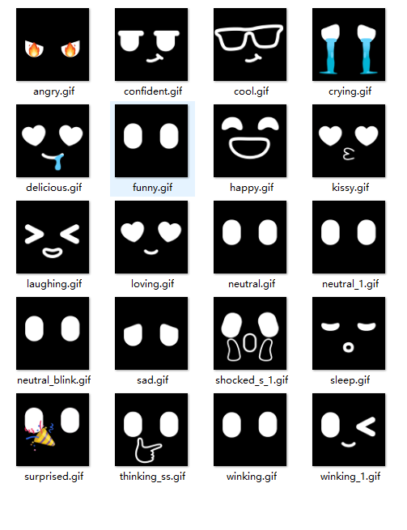
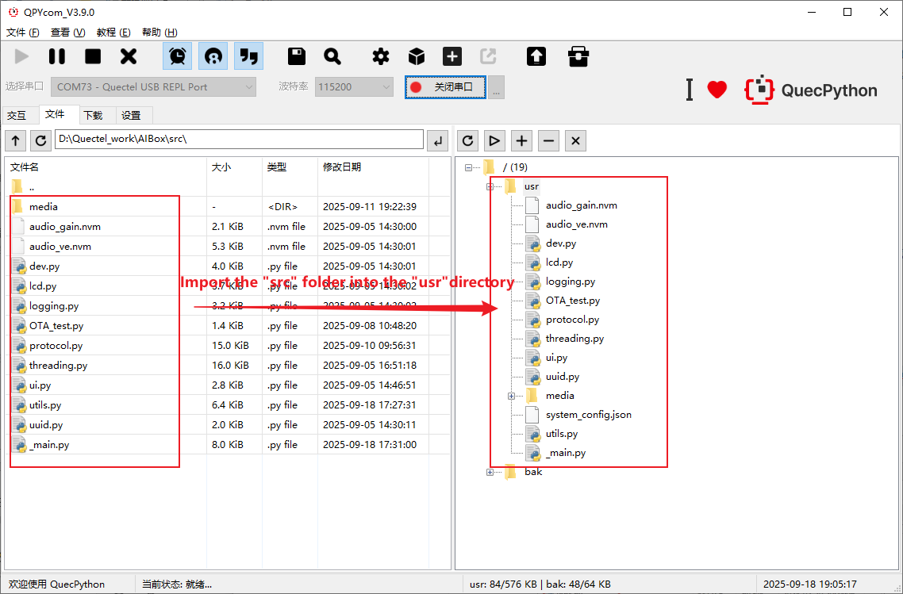

# AIbox Chatbot

## project brief

This project is a chatbot developed based on the Quectel EC800MCNLE development board, featuring functions such as voice recognition, emotion display, character switching, and sound simulation. 
Through this project, we hope to enable everyone to gain an understanding of AI hardware development and apply the rapidly advancing large language models to actual hardware devices.

## Open source directory structure

You can search for the required materials according to the following directory structure description.

## Project Function

**1.  One-step solution, the ultimate choice**

-  Multiple AI conversation characters, which can be switched to any preferred voice at any time.

-  Multilingual conversations, can serve as a portable language learning companion for practicing foreign languages.

-  Connect to multiple large models (Douba, Deepseek, Qwen3), assist with office work, and large models can easily handle it.

**2.Intelligent memory + emotional visualization, rejecting robots without emotions**

- **Dynamic Context Management**: Maintaining Memory of Conversation Even After Interruption

- **LCD Expression Feedback**: Enhances the authenticity of interaction through emojis such as 😊/🤔/😠

  

**3.Can interrupt and reject the AI's monologue at any time**

- Traditional AI: It must wait until it "finishes reading the script" before it can proceed ❌

- AI box: Supports voice interruption, just like chatting with a real person. ✅

  

**4.The agent recognizes the voice intention and automatically controls the device**

- "The sound is a bit loud. Turn it down a little." The agent issues a volume adjustment command to lower the volume.

**5.Environmentally friendly material casing, exquisite and durable with excellent hand feel**

## **product instruction：**

**1.**  Insert the SIM card with the notch facing inward and downward into the card slot.

**2.**  Press and hold the power button to turn on the device. Once the screen lights up, say "Xiaozhi, Xiaozhi" to wake up the intelligent assistant.

**3.**  Once the agent responds, the normal conversation can begin.

**Ps**：If there is no conversation for a long time, the connection will be disconnected. You can try saying "Xiaozhi, Xiaozhi" again to wake it up or restart the 	product.

## Software development process

#### device development

#### starting up

After completing the hardware connection work, if a COM port containing the words "Quectel USB" appears in the port list of the computer device manager, it indicates that the computer has successfully booted up.

#### Burn the firmware package

Refer to [this section](https://gitee.com/link?target=https%3A%2F%2Fdeveloper.quectel.com%2Fdoc%2Fquecpython%2FApplication_guide%2Fzh%2Fdev-tools%2FQPYcom%2Fqpycom-dw.html%23%E4%B8%8B%E8%BD%BD%E5%9B%BA%E4%BB%B6), and burn the corresponding firmware package to the development board.

### Script import and execution

1. Refer to [this section](https://gitee.com/link?target=https%3A%2F%2Fdeveloper.quectel.com%2Fdoc%2Fquecpython%2FGetting_started%2Fzh%2F4G%2Ffirst_python.html), import all the files in the `src` folder under the source code directory into the module file system, as shown in the following figure:

 

Refer to [this section](https://developer.quectel.com/doc/quecpython/Getting_started/zh/4G/first_python.html#executing-script-files), and execute the main program file `_main.py`.

1. Refer to [this section](https://gitee.com/link?target=https%3A%2F%2Fdeveloper.quectel.com%2Fdoc%2Fquecpython%2FGetting_started%2Fzh%2F4G%2Ffirst_python.html%23%E5%81%9C%E6%AD%A2%E7%A8%8B%E5%BA%8F%E8%BF%90%E8%A1%8C), and stop the program from running.

### Business debugging

### start the application

After executing the `_main.py` script, the program starts to run.

### Equipment Registration Scheme

If Xiaozhi is not registered, normal interaction cannot be carried out. When the program starts, OTA will return the verification code used for the registered device, and then go to [Xiaozhi AI Chatbot console](https://xiaozhi.me/) to register the device. After the registration is completed, run the script again to interact smoothly

### Activate Xiaozhi AI

As shown in the following picture, it is in a state ready to be awakened. A red light will flash on the development board, and you need to use the voice `Xiaozhi, Xiaozhi` to wake up Xiaozhi AI for a voice conversation.

After waking up, data related to connecting to the server or a prompt indicating connection failure will appear. When a connection failure occurs, please check if the network is normal.

When the system has not engaged in a conversation for a long time or has not received any commands, it will automatically enter a sleep state and wait for the next wake-up.

