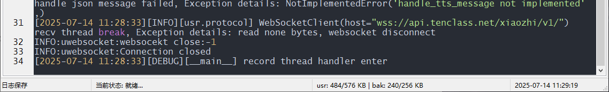

# AIbox 聊天机器人

## 项目简介

本项目是基于Quectel EC800MCNLE开发板的聊天机器人，具有语音识别，情感显示，角色切换，声音模拟的功能。

我们希望通过这个项目，能够帮助大家了解 AI 硬件开发，将当下飞速发展的大语言模型应用到实际的硬件设备中。

## 开源目录结构

## 项目功能

**1.  一步到位，终极之选**

-  多种AI对话角色，随时切换喜欢的声音

-  多语种对话，可作随身小家教练习外语

-  接入多种大模型（豆包，deepseek、Qwen3）,辅助办公，大模型轻松解决

  

**2.智能记忆+情感可视化，拒绝没有感情的机器人**

-  **动态上下文管理**：打断后仍记忆对话
-  **LCD表情反馈**：通过😊/🤔/😠等表情增强交互真实感

**3.能够随时打断，拒绝AI独白**

- 传统AI：必须等它"念完脚本"才能继续 ❌
- 小智AI：支持语音打断，像真人聊天一样自然 ✅

**4.智能体识别语音意图，自动控制设备**

- “声音有点大，调小一点”；智能体下发音量调整命令，降低音量。

**5.环保材质外壳，精致耐用手感好**

## **产品使用说明：**

**1.**  sim卡缺口朝内向下插入卡槽中

**2.**  长按电源键进行开机，待屏幕亮起后，呼叫“小智，小智”进行智能体唤醒

**3.**  智能体进行回应后即可开始进行正常对话

**Ps**：长时间未对话会断开连接，可尝试“小智，小智”再次唤醒或者重启产品

## 软件开发流程

### 设备开发

#### 开机

完成硬件连接的工作后，电脑设备管理器的端口列表中出现包含 `Quectel USB` 字样的 COM 口，表示开机成功。

#### 烧录固件包

参考[此章节](https://gitee.com/link?target=https%3A%2F%2Fdeveloper.quectel.com%2Fdoc%2Fquecpython%2FApplication_guide%2Fzh%2Fdev-tools%2FQPYcom%2Fqpycom-dw.html%23%E4%B8%8B%E8%BD%BD%E5%9B%BA%E4%BB%B6)，烧录对应型号固件包至开发板。

#### 脚本导入与运行

1. 参考[此章节](https://gitee.com/link?target=https%3A%2F%2Fdeveloper.quectel.com%2Fdoc%2Fquecpython%2FGetting_started%2Fzh%2F4G%2Ffirst_python.html)，将源码目录下 `src` 文件夹中的所有文件导入到模组文件系统，如下图所示：

 

参考[此章节](https://developer.quectel.com/doc/quecpython/Getting_started/zh/4G/first_python.html#执行脚本文件)，执行主程序文件 `_main.py`。

1. 参考[此章节](https://gitee.com/link?target=https%3A%2F%2Fdeveloper.quectel.com%2Fdoc%2Fquecpython%2FGetting_started%2Fzh%2F4G%2Ffirst_python.html%23%E5%81%9C%E6%AD%A2%E7%A8%8B%E5%BA%8F%E8%BF%90%E8%A1%8C)，停止程序运行。

## 业务调试

### 程序启动

执行 `_main.py` 脚本后，程序开始运行。

### 注册小智

如果小智没有被注册，那么无法进行正常交互，程序启动时OTA会返回注册设备所用的验证码，然后到[小智 AI 聊天机器人控制台](https://xiaozhi.me/)进行设备注册，注册完成后再次运行脚本就可以顺利交互了

### 激活小智

下图所示状态为待唤醒状态，开发板会出现红灯闪烁，需要语音“小智，小智”来唤醒小智AI进行语音对话。

唤醒后会出现连接服务器相关的数据或者是连接失败的提示，当出现连接失败时，请检查网络是否正常。

当系统长时间未进行对话或未接收到命令时会自动断开连接，等待下次唤醒。

