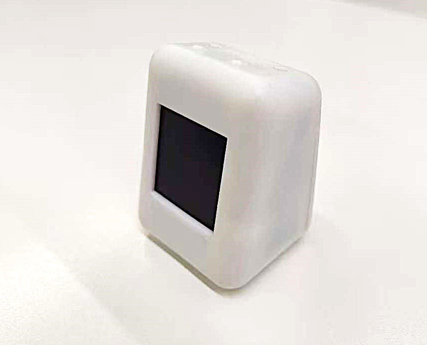
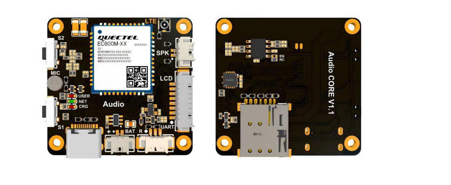
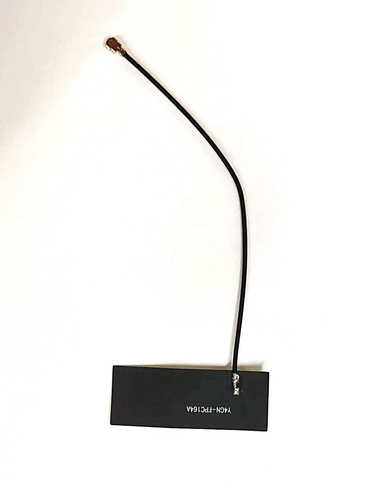
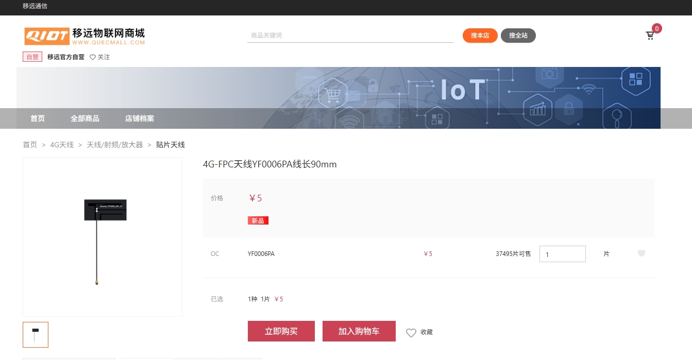
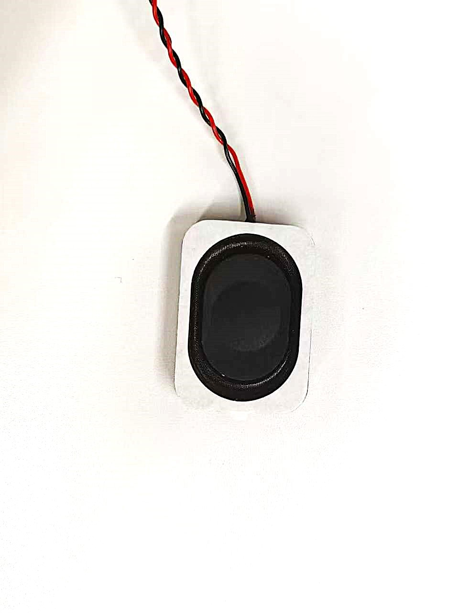
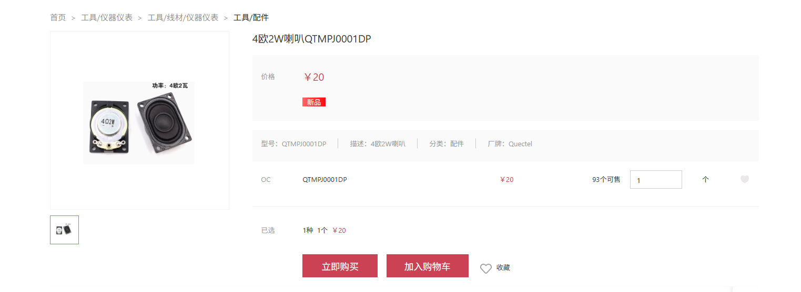
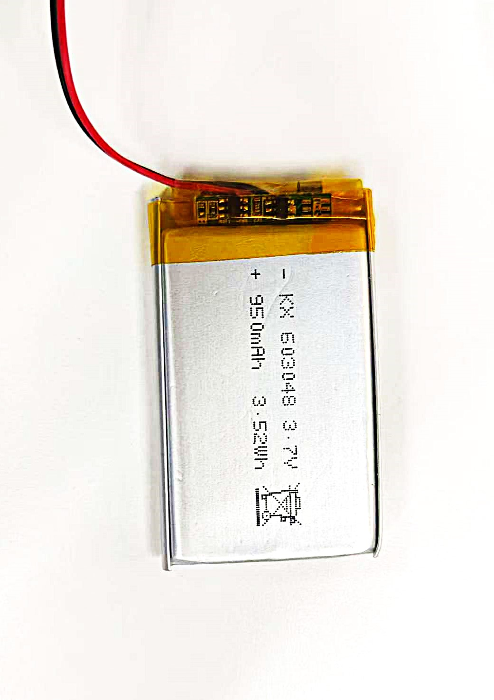
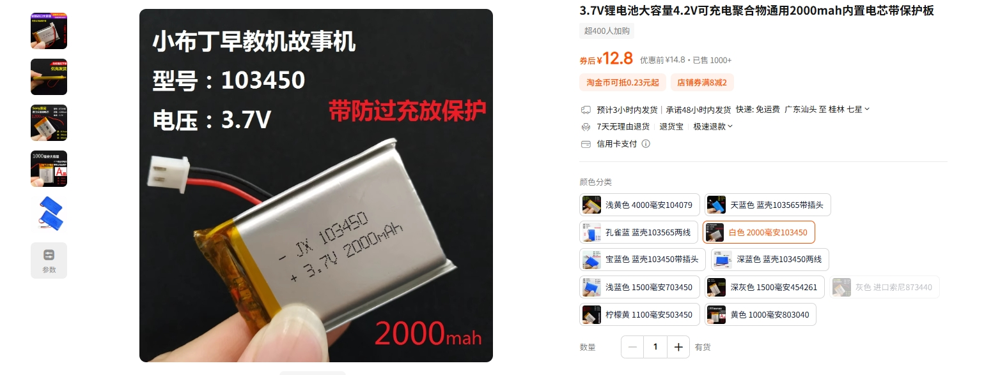
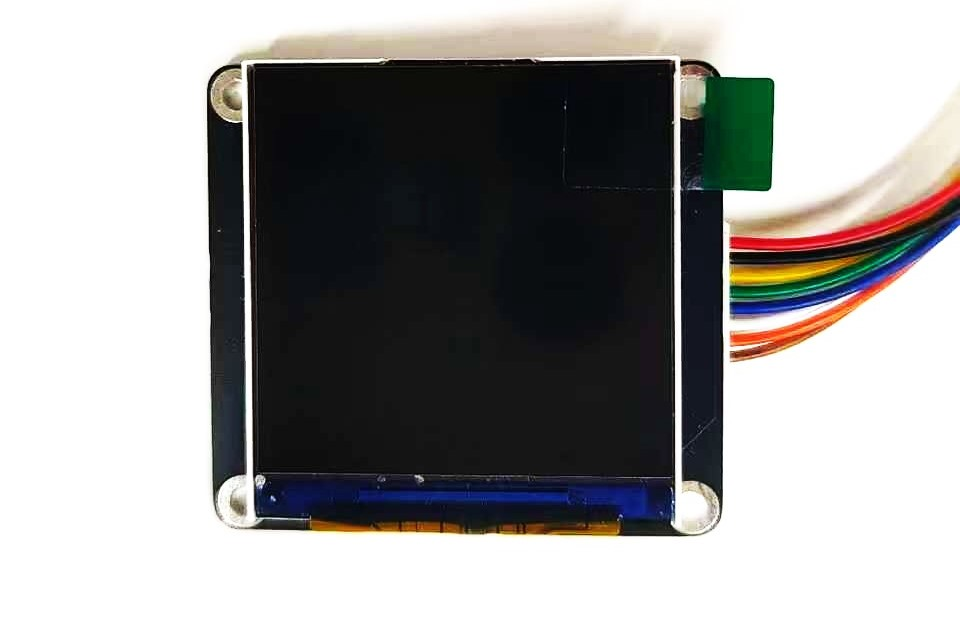

# 硬件概述

## AIbox成品

[商品详情](https://www.quecmall.com/goods-detail/2c90800b987f06090199512609ae0299)

## EC800MCNLE

可前往移远商城进行单独购买：[点击跳转](https://www.quecmall.com/goods-detail/2c90800c9488358b0195efe4c2020409)

## 天线

 

 

可前往移远商城进行单独购买：[点击跳转](https://www.quecmall.com/goods-detail/2c90800b90070e300190dd8fb4ea0113)

**1 产品描述 ：**

这款由凯捷尔公司生产的嵌入式 4G FPC 天线覆盖了主要的 4G LTE 频段，并兼容 3G/2G/LPWA 频段。其具有高效率和增益的特点，是实现高效数据传输且连接稳定的理想天线，即使在设备内部结构的影响下也能如此。该天线无需接地平面，设计为可以直接安装在塑料或非金属外壳的底部。与电缆和连接器的集成简便，这些部件可以定制以满足您的产品设计和射频模块的需求。 

**2 产品特性 :**

蜂窝式 LTE 

高效率 

出色的表现

## 喇叭

可前往移远商城进行单独购买：[4欧2W喇叭](https://www.quecmall.com/goods-detail/2c90800c9488358b01956aa656680239)

像下面这种就行

**产品描述：**

扬声器是一种把电信号转变为声信号的换能器件，扬声器的性能优劣对音质的影响很大。扬声器在音响设备中是一个最薄弱的器件，而对于音响效果而言，它又是一个最重要的部件。扬声器的种类繁多，而且价格相差很大。音频电能通过电磁，压电或静电效应，使其纸盆或膜片振动并与周围的空气产生共振(共鸣)而发出声音。

## 锂电池

**产品描述**

本产品使用的是型号603048，3.7V电压，电容量950毫安的聚合物锂电池

可自行搜索类似带插头的锂电池产品

## LCD

可查看该LCD屏相关参数：[LCD](.././doc/LCD资料.pdf)

