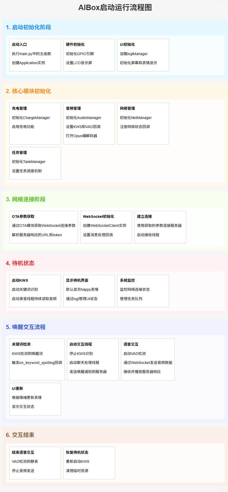
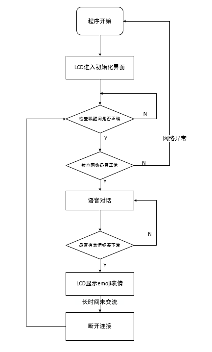

# 软件设计讲解

## 软件框架

### 框架设计图

 

### 业务系统启动流程

 

## 代码讲解

### AI 唤醒&人声检测

在`vad`检测到有人声数据上传时会调用`on_voice_activity_detection`这个回调函数，state打印为1时说明有人声；0则为说话结束。

```python
class Application(object):
    def on_keyword_spotting(self, state):
        logger.info("on_keyword_spotting: {}".format(state))
        if state[0] == 0:
            # 唤醒词触发
            if self.__working_thread is not None and self.__working_thread.is_running():
                return
            self.__working_thread = Thread(target=self.__working_thread_handler)
            self.__working_thread.start()
            self.__keyword_spotting_event.clear()
        else:
            self.__keyword_spotting_event.set()

    def on_voice_activity_detection(self, state):
        gc.collect()
        logger.info("on_voice_activity_detection: {}".format(state))
        if state == 1:
            self.__voice_activity_event.set()  # 有人声
        else:
            self.__voice_activity_event.clear()  # 无人声
```

### AI 初始化

初始化 AI 对象以及其他硬件驱动。

```python
class Application(object):

    def __init__(self):

        Pin(Pin.GPIO33, Pin.OUT, Pin.PULL_PD, 1)
        #初始化屏幕
        self.lvgl=lvglManager()
        # 初始化充电管理
        self.charge_manager = ChargeManager()

        # 初始化音频管理
        self.audio_manager = AudioManager()
        self.audio_manager.set_kws_cb(self.on_keyword_spotting)
        self.audio_manager.set_vad_cb(self.on_voice_activity_detection)

        # 初始化网络管理
        self.net_manager = NetManager()

        # 初始化任务调度器
        self.task_manager = TaskManager()

        # 初始化协议
        self.__protocol = WebSocketClient()
        self.__protocol.set_callback(
            audio_message_handler=self.on_audio_message,
            json_message_handler=self.on_json_message
        )

        self.__working_thread = None
        self.__record_thread = None
        self.__record_thread_stop_event = Event()
        self.__voice_activity_event = Event()
        self.__keyword_spotting_event = Event()
```

### AI 对话&打断逻辑

在唤醒AI之后启动该人声音频检测与上传的线程，`self.start_vad()`用于启动录音功能，当有人声时会通过websocket发送“开始监听”的标志位`start`，然后执行`self.__protocol.abort()`结束当前的语音从而实现打断AI说话。

```python
class Application(object):
    def __chat_process(self):
        self.start_vad()
        try:
            with self.__protocol:
                self.power_red_led.on()
                self.__protocol.hello()
                self.__protocol.wakeword_detected("小智")
                is_listen_flag = False
                while True:
                    data = self.audio_manager.opus_read()
                    if self.__voice_activity_event.is_set():
                        # 有人声
                        if not is_listen_flag:
                            self.audio_manager.stop()
                            self.audio_manager.aud.stopPlayStream()
                            self.__protocol.listen("start")
                            self.__protocol.abort() #终止当前说话（TTS 播放）或语音通道。
                            is_listen_flag = True
                        self.__protocol.send(data)
                        # logger.debug("send opus data to server")
                    else:
                        if is_listen_flag:
                            self.__protocol.listen("stop")
                            is_listen_flag = False
                    if not self.__protocol.is_state_ok():
                        break
                    # logger.debug("read opus data length: {}".format(len(data)))
        except Exception as e:
            logger.debug("working thread handler got Exception: {}".format(repr(e)))
        finally:
            self.stop_vad()

```

### 音频管理

统一管理设备的音频输入输出、编解码、语音识别相关功能（关键词识别 KWS 和语音活动检测 VAD），并提供回调接口供上层应用使用。

```python
class AudioManager(object):

    def __init__(self, channel=0, volume=11, pa_number=29):
        self.aud = audio.Audio(channel)  # 初始化音频播放通道
        self.aud.set_pa(pa_number)
        self.aud.setVolume(volume)  # 设置音量
        self.aud.setCallback(self.audio_cb)
        self.rec = audio.Record(channel)
        self.__skip = 0

    # ========== 音频文件 ====================

    def audio_cb(self, event):
        if event == 0:
            # logger.info('audio play start.')
            pass
        elif event == 7:
            # logger.info('audio play finish.')
            pass
        else:
            pass

    def play(self, file):
        self.aud.play(0, 1, file)

    # ========= opus ====================

    def open_opus(self):
        self.pcm = audio.Audio.PCM(0, 1, 16000, 2, 1, 15)  # 5 -> 25
        self.opus = Opus(self.pcm, 0, 6000)  # 6000 ~ 128000
    
    def close_opus(self):
        self.opus.close()
        self.pcm.close()
        del self.opus
        del self.pcm
    
    def opus_read(self):
        return self.opus.read(60)

    def opus_write(self, data):
        return self.opus.write(data)

    # ========= vad & kws ====================

    def set_kws_cb(self, cb):
        self.rec.ovkws_set_callback(cb)
            
    def set_vad_cb(self, cb):
        def wrapper(state):
            if self.__skip != 2:
                self.__skip += 1
                return
            return cb(state)
        self.rec.vad_set_callback(wrapper)

    def end_cb(self, para):
        if(para[0] == "stream"):
            if(para[2] == 1):
                pass
            elif (para[2] == 3):
                pass
            else:
                pass
        else:
            pass
    
    def start_kws(self):
        self.rec.ovkws_start("_xiao_zhi_xiao_zhi", 0.7)

    def stop_kws(self):
        self.rec.ovkws_stop()
    
    def start_vad(self):
        self.__skip = 0
        self.rec.vad_start()
    
    def stop_vad(self):
        self.rec.vad_stop()
```

## LCD屏显

通过会话总线`sys_bus`来控制LCD的表情显示

```python
import lvgl as lv
import utime
import sys_bus
from usr.lcd import *
from machine import Timer
import log

log.basicConfig(level=log.INFO)
logger = log.getLogger("UI")


screen = lv.obj()
screen.set_size(240,240)
screen.set_scrollbar_mode(lv.SCROLLBAR_MODE.OFF)

# Set style for screen, Part: lv.PART.MAIN, State: lv.STATE.DEFAULT.
screen.set_style_bg_opa(255, lv.PART.MAIN|lv.STATE.DEFAULT)
screen.set_style_bg_color(lv.color_hex(0x000000), lv.PART.MAIN|lv.STATE.DEFAULT)
screen.set_style_bg_grad_dir(lv.GRAD_DIR.NONE, lv.PART.MAIN|lv.STATE.DEFAULT)

# Create flex flow
screen.center()
screen.set_flex_align(lv.FLEX_ALIGN.SPACE_EVENLY, lv.FLEX_ALIGN.CENTER, lv.FLEX_ALIGN.CENTER)
screen.set_flex_flow(lv.FLEX_FLOW.COLUMN)
# Create screen_gif
screen_gif = lv.gif(screen)
screen_gif.set_src("U:/media/happy.gif")
screen_gif.set_style_bg_color(lv.color_hex(0x000000), 0)  # 黑色背景
screen_gif.set_style_bg_opa(lv.OPA.COVER, 0)
screen_gif.set_size(240, 240)

def update_emoji(topic,msg):
    screen_gif.set_style_opa(lv.OPA.TRANSP, 0)
    if msg == "happy":
        screen_gif.set_src("U:/media/happy.gif")
    elif msg == "cool":
        screen_gif.set_src("U:/media/cool.gif")
    elif msg == "thinking":
        screen_gif.set_src("U:/media/thinking.gif")
    elif msg == "angry":
        screen_gif.set_src("U:/media/angry.gif")
    elif msg == "sleep":
        screen_gif.set_src("U:/media/sleep.gif")
    elif msg == "confident":
        screen_gif.set_src("U:/media/confident.gif")
    elif msg == "crying":
        screen_gif.set_src("U:/media/crying.gif")
    elif msg == "delicious":
        screen_gif.set_src("U:/media/delicious.gif")
    elif msg == "funny":
        screen_gif.set_src("U:/media/funny.gif")
    elif msg == "kissy":
        screen_gif.set_src("U:/media/kissy.gif")
    elif msg == "laughing":
        screen_gif.set_src("U:/media/laughing.gif")
    elif msg == "loving":
        screen_gif.set_src("U:/media/loving.gif")
    elif msg == "neutral":
        screen_gif.set_src("U:/media/neutral.gif")
    elif msg == "sleepy":
        screen_gif.set_src("U:/media/sleep.gif")
    elif msg == "sad":
        screen_gif.set_src("U:/media/sad.gif")
    elif msg == "surprised":
        screen_gif.set_src("U:/media/surprised.gif")
    elif msg == "winking":
        screen_gif.set_src("U:/media/winking.gif")
    elif msg == "silly":
        screen_gif.set_src("U:/media/silly.gif")
    elif msg == "relaxed":
        screen_gif.set_src("U:/media/relaxed.gif")
    elif msg == "embarrassed":
        screen_gif.set_src("U:/media/embarrassed.gif")
    else:
        pass
    utime.sleep_ms(20)
    screen_gif.set_style_opa(lv.OPA.COVER, 0)
    
sys_bus.subscribe("update_emoji", update_emoji)
        
class lvglManager:
    #@staticmethod
    def __init__(self):
        lv.scr_load(screen)

```

## MCP管理

基于 MCP 协议的消息构造与发送功能，涵盖了初始化、工具列表查询、工具调用响应以及设备通知等场景。所有消息均遵循 JSON-RPC 2.0 格式，并通过 `send_mcp` 方法统一发送，确保了代码的模块化和一致性。

```python
class WebSocketClient(object):
    def send_mcp(self, payload, session_id=""):
        """
        发送标准MCP消息,payload为JSON-RPC 2.0格式字典
        """
        with self.__resp_helper:
            self.send(
                JsonMessage(
                    {
                        "session_id": session_id,
                        "type": "mcp",
                        "payload": payload
                    }
                ).to_bytes()        
            )	
    def mcp_initialize(self, capabilities=None, session_id="", req_id=1):
        """
        发送MCP initialize响应
        """
        payload = {
            "jsonrpc": "2.0",
            "id": req_id,
            "result": {
                "protocolVersion": "2025-9-03",
                "capabilities": {
                    "tools":{},
                    "notifications": {}
                },
                "serverInfo": {
                "name": 'xiaozhi-mqtt-client',
                "version": "1.0.0"
            }
        }
        }  
        self.send_mcp(payload, session_id)
    def mcp_tools_list(self, cursor="", session_id="", req_id=2):
        """
        发送MCP tools/list响应请求
        """
        payload = {
            "jsonrpc": "2.0",
            "id": req_id,
            "result": {
                "tools": [
                {
                    "name": "self.setvolume_down()",
                    "description": "只通过调用setvolume_down方法来控制音量变小,接收到回应后会播报当前音量大小",
                    "inputSchema": {}
                },
                {
                    "name": "self.setvolume_up()",
                    "description": "只通过调用setvolume_up方法来控制音量变大,接收到回应后会播报当前音量大小",
                    "inputSchema": {}
                },
                {
                    "name": "self.setvolume_close()",
                    "description": "只通过调用setvolume_close方法来静音,接收到回应后会播报当前音量大小",
                    "inputSchema": {}
                },
                ],
            }
            }
        
        self.send_mcp(payload, session_id)
        
    def mcp_tools_call(self, session_id="", req_id="", error=None, tool_name=""):
        """
        发送MCP tools/call响应
        :param error: 如果为None则返回成功响应,否则返回错误响应(字典,包含code和message)
        """
        if error is None:
            if tool_name == "self.setvolume_down()":
                payload = {
                    "jsonrpc": "2.0",
                    "id": req_id,
                    "result": {
                        "content": [
                            { "type": "text", "text": "音量已调小 "}
                        ],
                        "isError": False
                    }
                }
            elif tool_name == "self.setvolume_up()":
                payload = {
                    "jsonrpc": "2.0",
                    "id": req_id,
                    "result": {
                        "content": [
                            { "type": "text", "text": "音量已调大" }
                        ],
                        "isError": False
                    }
                }
            elif tool_name == "self.setvolume_close()":
                payload = {
                    "jsonrpc": "2.0",
                    "id": req_id,
                    "result": {
                        "content": [
                            { "type": "text", "text": "已静音" }
                        ],
                        "isError": False
                    }
                }      
        else:
            payload = {
                "jsonrpc": "2.0",
                "id": req_id,
                "error": {
                    "code": error.get("code", -32601),
                    "message": error.get("message", "Unknown error")
                }    
        self.send_mcp(payload, session_id)                
                
    def mcp_notify(self, method, params, session_id=""):
        """
        设备主动发送MCP通知  
        """
        payload = {
            "jsonrpc": "2.0",
            "method":  "notifications/state_changed",
            "params": {
                "newState": "idle",
                "oldState": "connecting"
                    }
        }
        self.send_mcp(payload, session_id)                
```
